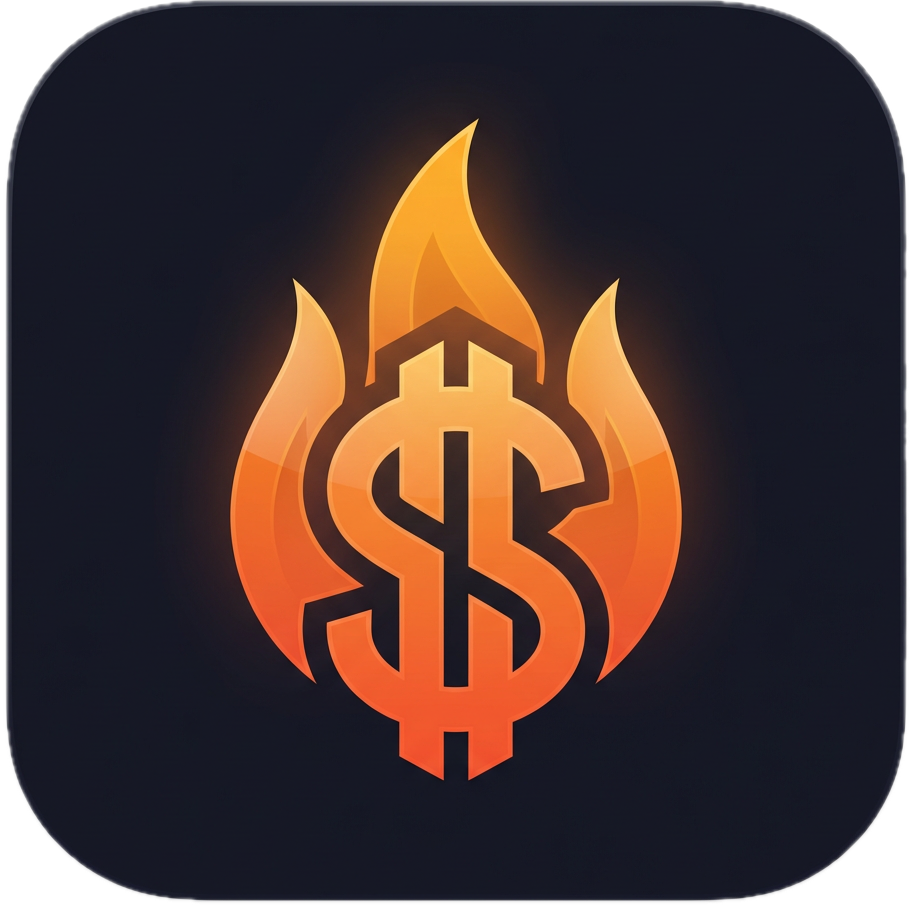
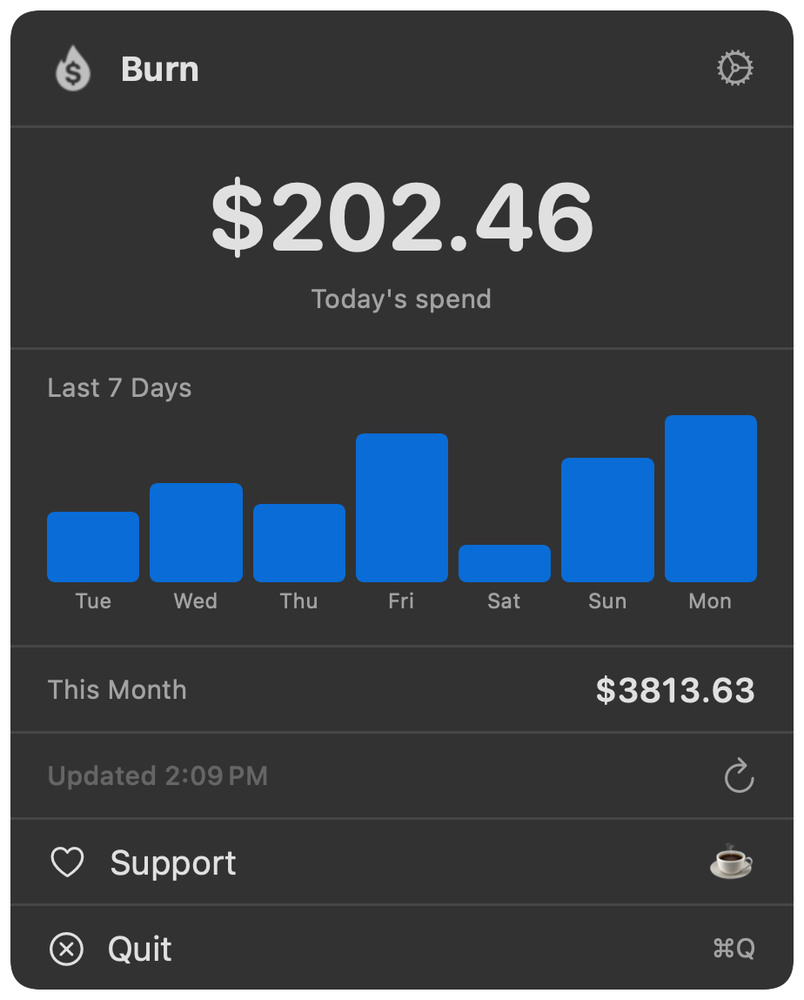

<div align="center">
<h1>🔥 Burn</h1>



<p>Track your Claude Code spending from the macOS menu bar</p>
</div>

---

<p align="center">
  
</p>

See today's cost at a glance. Click for a 7-day chart and monthly total.

## Prerequisites

Burn shells out to [ccusage](https://github.com/ryoppippi/ccusage) for usage data:
```bash
npm i -g ccusage
```

## Install

**Homebrew** (recommended):
```bash
brew tap maferland/tap
brew install --cask burn
```

**Manual**: Download DMG from [Releases](https://github.com/maferland/burn/releases), open it, drag `Burn.app` to Applications.

**Build from source**:
```bash
git clone https://github.com/maferland/burn.git
cd burn
make install
```

## Usage

Run `Burn`. A flame icon appears in your menu bar with today's spend.

- **Click** — Popover with today's cost, 7-day bar chart, and monthly total
- **Refresh** — Manual refresh button, or auto-refresh every 1–30 minutes
- **Menu bar display** — Show icon only, dollar amount, or both
- **Start at Login** — Run automatically when you log in
- **Quit** — ⌘Q

## Privacy

Burn runs `ccusage` locally. No network requests beyond what ccusage does. No data collection. No analytics.

## Requirements

- macOS 14 (Sonoma) or later
- [ccusage](https://github.com/ryoppippi/ccusage) (`npm i -g ccusage`)

## Support

If Burn helps you track your spending, consider buying me a coffee:

[](https://buymeacoffee.com/maferland)

## License

MIT — see [LICENSE](LICENSE)
