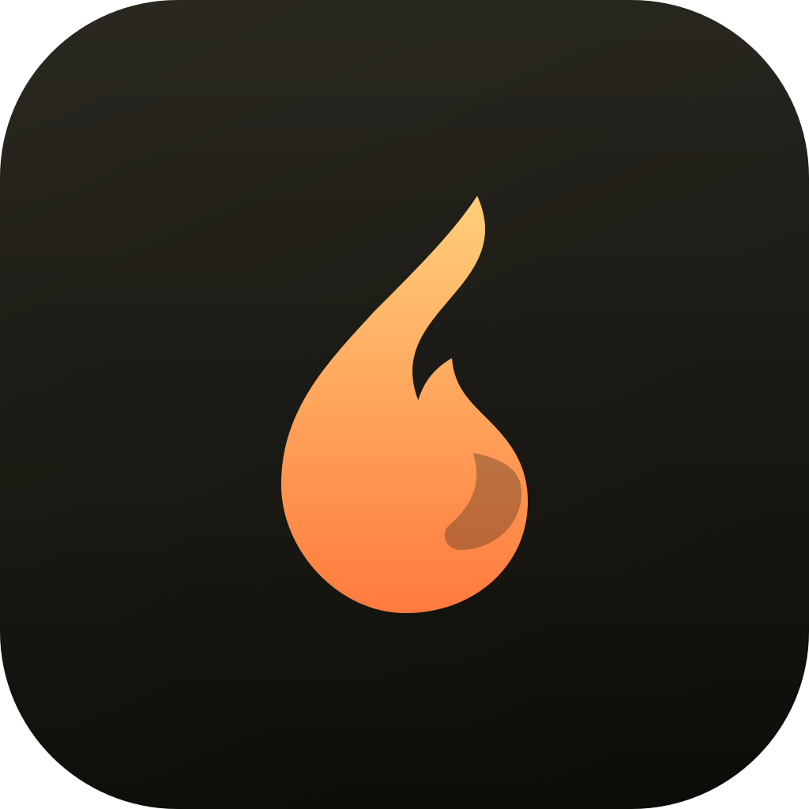
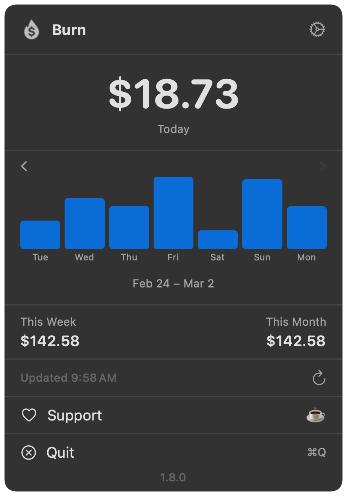

<div align="center">
<h1>🔥 Burn</h1>



<p>Track your Claude Code spending from the macOS menu bar</p>
</div>

---

<p align="center">
  
</p>

See today's cost at a glance. Click for a 7-day chart and monthly total.

## Install

**Homebrew** (recommended):
```bash
brew install --cask maferland/tap/burn
```

**Manual**: Download DMG from [Releases](https://github.com/maferland/burn/releases), open it, drag `Burn.app` to Applications.

**Build from source**:
```bash
git clone https://github.com/maferland/burn.git
cd burn
make install
```

## Usage

Run `Burn`. A flame icon appears in your menu bar with today's spend.

- **Click** — Popover with today's cost, 7-day bar chart, and monthly total
- **Refresh** — Manual refresh button, or auto-refresh every 1–30 minutes
- **Menu bar display** — Show icon only, dollar amount, or both
- **Start at Login** — Run automatically when you log in
- **Quit** — ⌘Q

## Extensions

Burn can show extra signals next to the cost. Extensions contribute a menu bar segment and a popover tab. They're toggled in **Settings → Extensions**.

### PRs

Tracks pull requests you opened today, this week, and this month. The menu bar reads `$X · ⎇ N · $Y` where `Y` is `today's cost ÷ today's PR count` — your average cost per PR.

Requires the [GitHub CLI](https://cli.github.com/) authenticated:

```bash
brew install gh
gh auth login
```

In **Settings → Extensions → PRs → Orgs**, type a comma-separated list of repository owners to filter (e.g. `acme, maferland`). Leave it empty to count every PR you can see.

Self-hosted Gitea and Forgejo count too, alongside GitHub. Fill in **Forgejo** with the host (e.g. `git.example.com`) and **Token** with an access token carrying the `read:issue` scope, generated at `https://<host>/user/settings/applications`. The token goes to your Keychain, never to disk in plain text. Rows from that host show it next to the repository name.

## Privacy

Burn reads Claude Code session data directly from `~/.claude/projects/`. Model pricing is fetched from [LiteLLM](https://github.com/BerriAI/litellm) and cached locally. No data collection. No analytics.

## Requirements

- macOS 14 (Sonoma) or later

## Support

If Burn helps you track your spending, consider buying me a coffee:

[](https://buymeacoffee.com/maferland)

## License

MIT — see [LICENSE](LICENSE)
